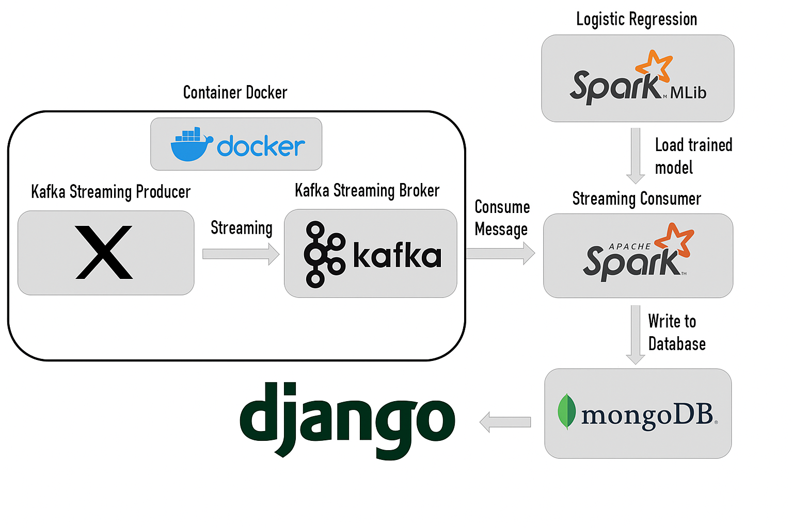
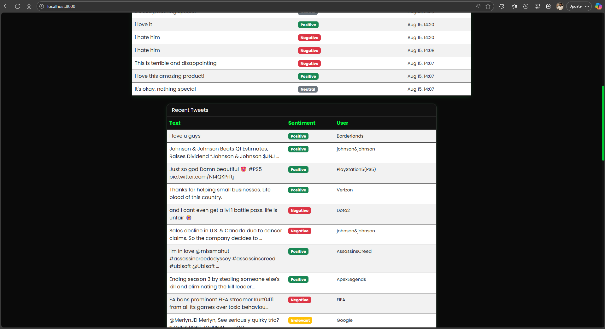
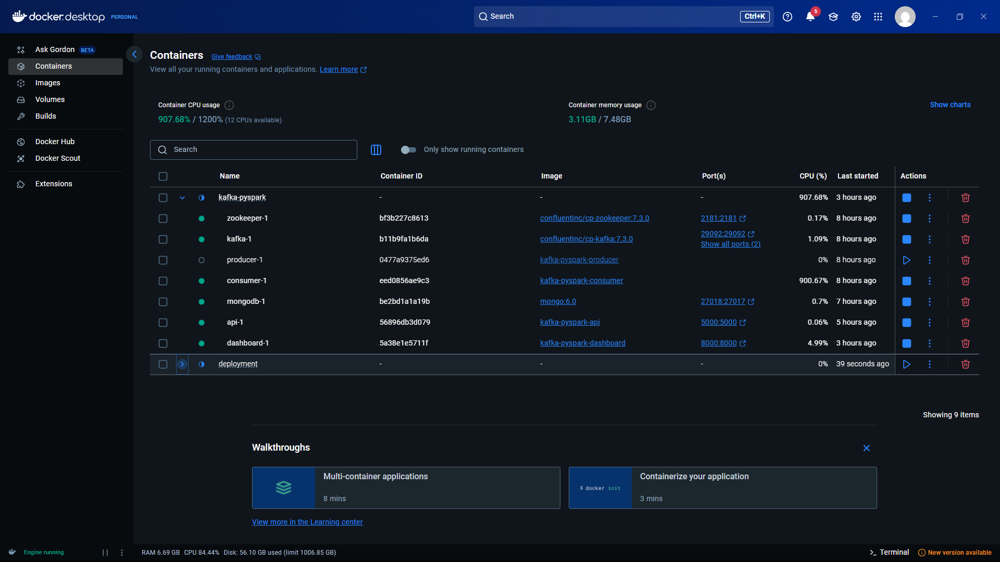
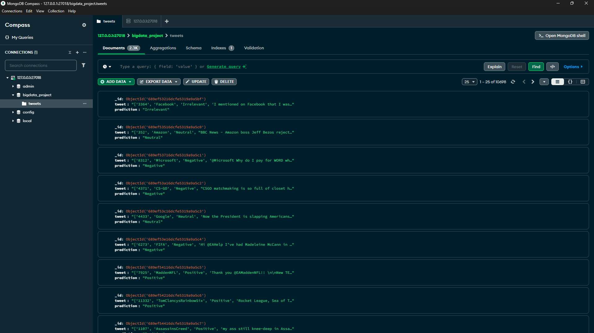

# 🚀 TweetPulse Pro - Advanced Real-Time Twitter Sentiment Analytics

[](https://python.org)
[](https://docker.com)
[]()
[]()

## 🎯 Overview

**TweetPulse Pro** is a cutting-edge, high-performance real-time Twitter sentiment analysis platform that processes tweets with lightning speed and accuracy. Built with a modern black & green aesthetic and optimized for enterprise use.

<p align="center">
  
  
</p>

## Overview


**TweetPulse Pro** is a modern, production-ready analytics platform for real-time sentiment analysis of Twitter data. It leverages industry-standard technologies—**Apache Kafka**, **Apache Spark**, **MongoDB**, **Django**, **Flask REST API**, and **Docker**—to deliver scalable, reliable, and extensible analytics and visualization.

**Author:** Manula Fernando  
**Last Updated:** August 15, 2025

---

## Key Features

- **Real-Time Data Pipeline**: Kafka ingests tweets, Spark Streaming processes and classifies sentiment, MongoDB stores results.
- **RESTful Analytics API**: Flask-based API exposes analytics endpoints for dashboards and external integrations.
- **Modern Dashboard**: Django + Bootstrap 5 dashboard with advanced, interactive visualizations (Chart.js, matplotlib, seaborn).
- **Modular, Configurable Code**: All scripts use YAML config, logging, and CLI overrides for easy customization and deployment.
- **Full Docker Orchestration**: One-command startup with Docker Compose for all services (Kafka, Zookeeper, MongoDB, Producer, Consumer, API, Dashboard).
- **Production-Ready Practices**: Error handling, logging, environment variables, and clear separation of concerns.

---


## Repository Structure

```text
Real-Time-Twitter-Sentiment-Analysis/
├── tweetpulse-dashboard/       # Django dashboard (Bootstrap, Chart.js, user features)
│   ├── manage.py
│   ├── dashboard/              # Django app code
│   ├── templates/              # HTML templates
│   └── logistic_regression_model.pkl/  # Model for dashboard
├── tweetpulse-pipeline/        # Kafka producer & Spark consumer (YAML-configurable)
│   ├── producer-validation-tweets.py
│   ├── consumer-pyspark.py
│   ├── producer_config.yaml
│   ├── consumer_config.yaml
│   ├── analytics_api.py        # Flask REST API for analytics
│   ├── Dockerfile.producer
│   ├── Dockerfile.consumer
│   ├── Dockerfile.api
│   └── docker-compose.analytics.yml
├── tweetpulse-ml-model/        # Jupyter notebooks, datasets, trained models
│   ├── Big_Data.ipynb
│   ├── twitter_training.csv
│   ├── twitter_validation.csv
│   └── logistic_regression_model.pkl/
├── imgs/                       # Architecture and dashboard images
│   ├── Flow_DIagram.png
│   ├── Dashboard_1.png, Dashboard_2.png, Dashboard_3.png, Dashboard_4.png
│   ├── Login_Page.png, Register_Page.png
│   ├── MongoDB_Connection.png, Docker_Container.png
│   └── Confusion_matrix.png, Text_Classifer.png
├── requirements.txt            # Python dependencies
├── zk-single-kafka-single.yml  # Kafka/Zookeeper Docker Compose
└── README.md                   # Project documentation
```

---


## Quick Start (Recommended: Dockerized Workflow)

> **Recommended:** Use Docker Compose for a reproducible, production-like environment. All dependencies and services are containerized.

### 1. Prerequisites

- [Docker Desktop](https://www.docker.com/products/docker-desktop/) (Windows/Mac/Linux)
- [Git](https://git-scm.com/)


### 2. Clone the Repository

```bash
git clone <your-repo-url>
cd TweetPulse-Pro
```


### 3. Build and Start the Full Analytics Stack

```powershell
docker compose -f tweetpulse-pipeline/docker-compose.analytics.yml up --build
```


This will launch:
- Zookeeper & Kafka (real-time ingestion)
- MongoDB (storage)
- Producer (tweets to Kafka)
- Consumer (Spark streaming, sentiment analysis)
- REST API (analytics endpoints)
- Django Dashboard (visualization)


### 4. Access the Platform

- **Dashboard:** [http://localhost:8000](http://localhost:8000)
- **REST API:** [http://localhost:5000](http://localhost:5000)
- **MongoDB Compass:** Connect to `mongodb://localhost:27017`

---


## Full Setup & Manual Steps (For Advanced Users)

### 1. Python Environment (Windows)

- Install Python 3.10+ and create a virtual environment:
  ```powershell
  python -m venv .venv
  .\.venv\Scripts\Activate.ps1
  pip install -r requirements.txt
  ```


### 2. Kafka & Zookeeper

- Start with Docker Compose:
  ```powershell
  docker compose -f zk-single-kafka-single.yml up -d
  ```


### 3. MongoDB

- Start MongoDB (Docker or local install). Use MongoDB Compass for GUI.


### 4. Producer & Consumer

- Edit `tweetpulse-pipeline/producer_config.yaml` and `consumer_config.yaml` as needed.
- Run producer:
  ```powershell
  python tweetpulse-pipeline/producer-validation-tweets.py --config tweetpulse-pipeline/producer_config.yaml
  ```
- Run consumer:
  ```powershell
  $env:JAVA_HOME = "C:\\Program Files\\Java\\jdk-17"  # adjust if needed
  $env:PATH = "$env:JAVA_HOME\bin;$env:PATH"
  python tweetpulse-pipeline/consumer-pyspark.py --config tweetpulse-pipeline/consumer_config.yaml
  ```


### 5. Analytics API

- Run Flask API:
  ```powershell
  python tweetpulse-pipeline/analytics_api.py
  ```


### 6. Django Dashboard

- Collect static files:
  ```powershell
  python tweetpulse-dashboard/manage.py collectstatic --noinput
  ```
- Run server:
  ```powershell
  python tweetpulse-dashboard/manage.py runserver
  ```

### Notes for Windows

- Ensure Docker Desktop is running and WSL2 backend is enabled.
- If running services outside Docker, install Java 17 (required by Spark) and set JAVA_HOME.
- If Kafka inside Docker and apps on host, use `localhost:9092`. If apps inside Docker, they use `kafka:9092` via compose.

---

---

## Advanced Usage & Manual Workflow

> For development, debugging, or custom deployments, you can run individual services/scripts manually. See each folder's README or script docstrings for details.

---


## Best Practices & Industry Standards

- **Containerization:** All services are Dockerized for reproducibility and scalability.
- **Configuration Management:** Use YAML config files and environment variables for all scripts/services.
- **Logging & Monitoring:** All components use structured logging; integrate with ELK/Prometheus for production.
- **Modular Codebase:** Producer, consumer, and API are fully modular and independently deployable.
- **Security:** Never commit secrets; use `.env` files and Docker secrets for credentials.
- **Testing:** Unit/integration tests recommended for all modules (see `/tests` if present).
- **Documentation:** Keep this README and all configs up to date; use docstrings and comments in code.
- **Naming Consistency:** Use the project name "TweetPulse Pro" in all documentation, scripts, and UI for clarity and branding.
- **Author:** Manula Fernando (2025)

---


## Data & Model

- **Dataset:** [Kaggle Twitter Entity Sentiment Analysis](https://www.kaggle.com/datasets/jp797498e/twitter-entity-sentiment-analysis)
- **ML Model:** Trained with PySpark; see `tweetpulse-ml-model/` for notebooks and details.

---


## Screenshots

<p align="center">
  
</p>

<p align="center">
  
</p>

<p align="center">
  
</p>

<p align="center">
  
</p>

<p align="center">
  
</p>


## Author

- **Manula Fernando**

For previous contributors and academic context, see project history.

---


## Support & Contribution

- Open issues or pull requests for improvements, bugfixes, or questions.
- For custom deployments, advanced analytics, or consulting, contact the author via GitHub.

---


**Happy coding! Explore, extend, and build on TweetPulse Pro for your own analytics needs.**
